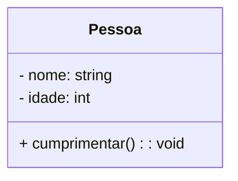
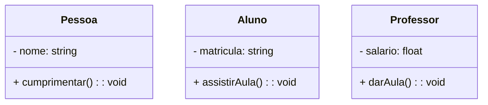
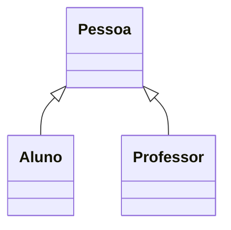
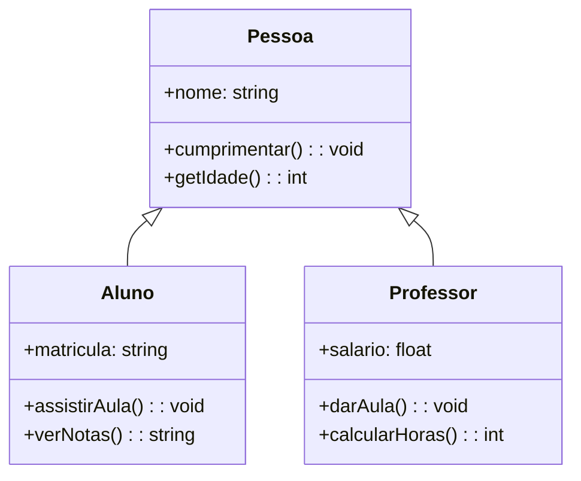
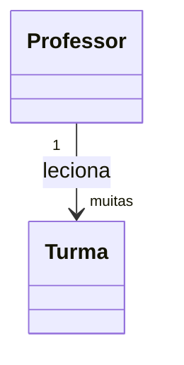
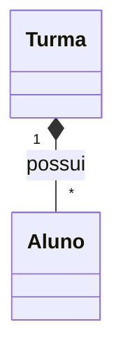
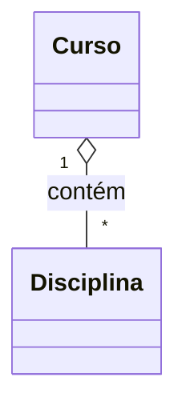
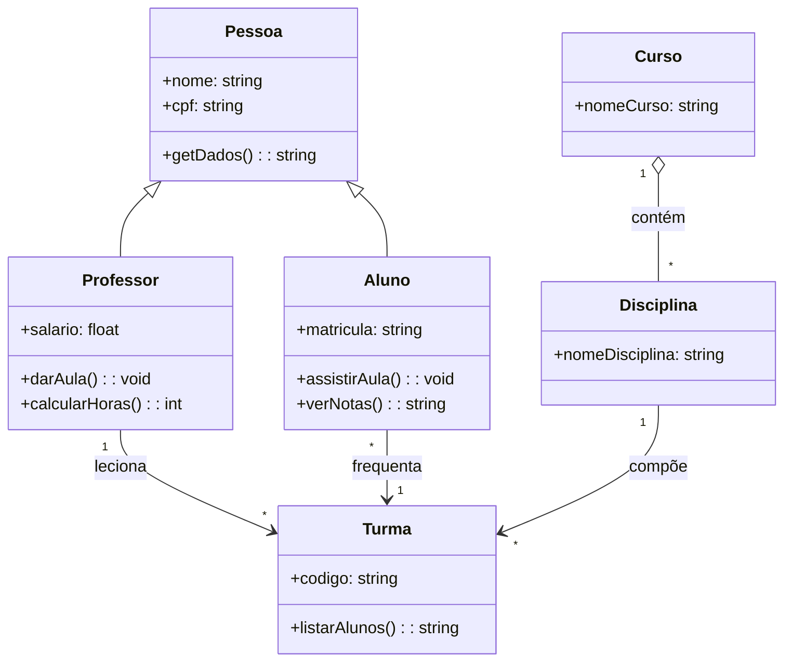

## Estrutura Básica de uma Classe

## Múltiplas Classes

## Herança

## Herança com Múltiplos Métodos e Retorno

## Associação Simples

## Composição (forte)

## Agregação (fraca)

## Diagrama Completo de Exemplo

