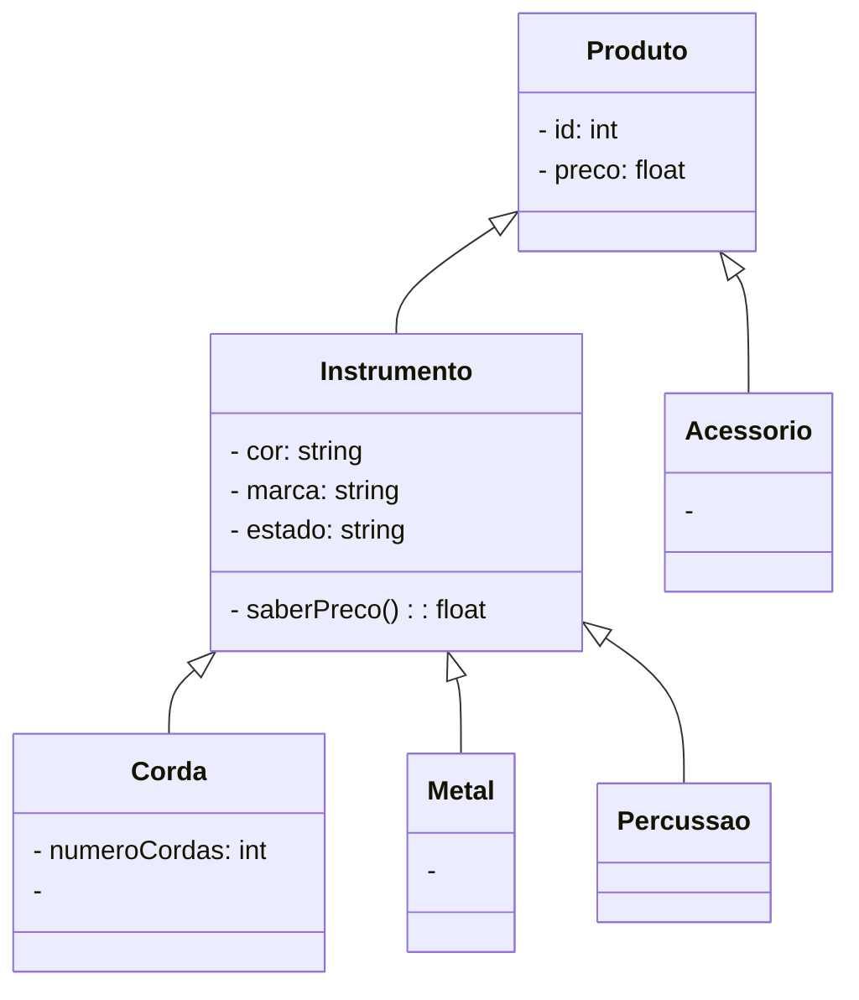

```mermaid
classDiagram
  class Produto {
    - id: int
    - preco: float
}
  class Instrumento {
    - cor: string
    - marca: string
    - estado: string
    - saberPreco(): float
}
  class Corda {
    - numeroCordas: int
    - 
}
  class Metal {
    - 
}
  class Percussao {
    
}
  class Acessorio {
    - 
}

Produto <|-- Instrumento
Produto <|-- Acessorio
Instrumento <|-- Corda
Instrumento <|-- Metal
Instrumento <|-- Percussao
```

