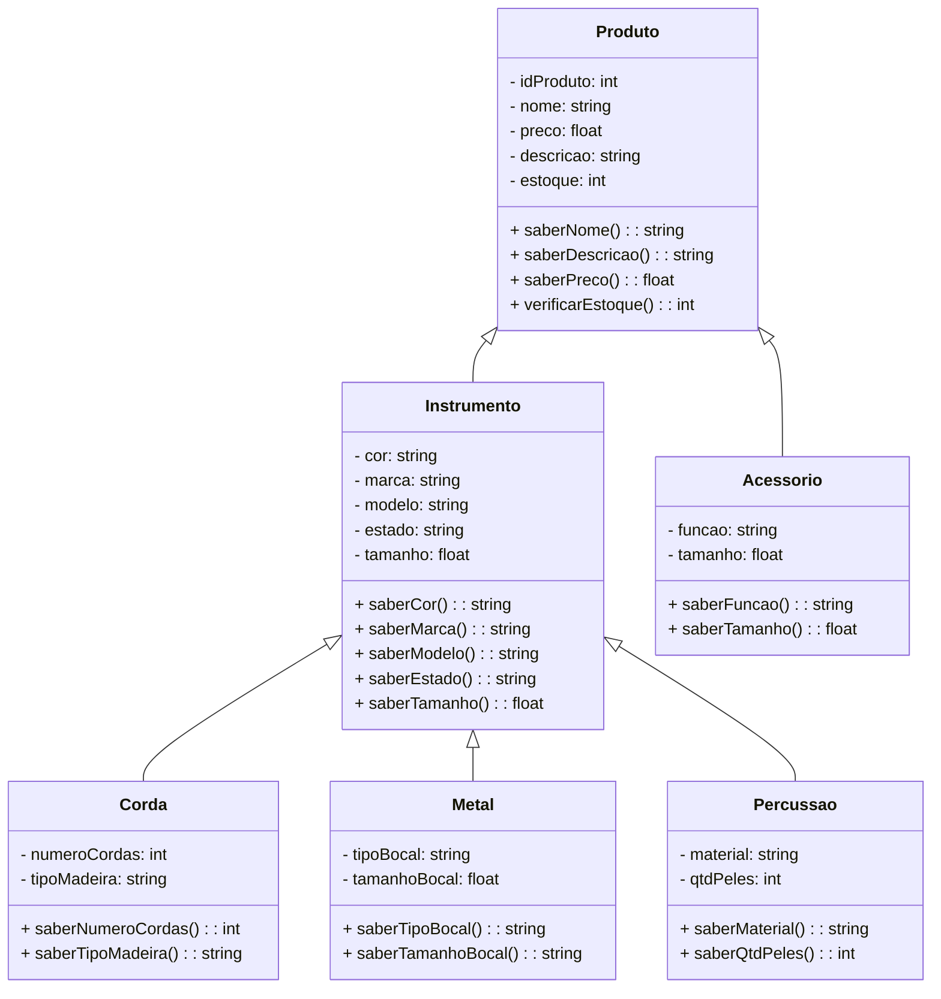

```mermaid
classDiagram
  class Produto {
    - idProduto: int
    - nome: string
    - preco: float
    - descricao: string
    - estoque: int
    + saberNome(): string
    + saberDescricao(): string
    + saberPreco(): float
    + verificarEstoque(): int
}
  class Instrumento {
    - cor: string
    - marca: string
    - modelo: string
    - estado: string
    - tamanho: float
    + saberCor(): string
    + saberMarca(): string
    + saberModelo(): string
    + saberEstado(): string
    + saberTamanho(): float
}
  class Corda {
    - numeroCordas: int
    - tipoMadeira: string
    + saberNumeroCordas(): int
    + saberTipoMadeira(): string
}
  class Metal {
    - tipoBocal: string
    - tamanhoBocal: float
    + saberTipoBocal(): string
    + saberTamanhoBocal(): string
}
  class Percussao {
    - material: string
    - qtdPeles: int
    + saberMaterial(): string
    + saberQtdPeles(): int
}
  class Acessorio {
    - funcao: string
    - tamanho: float
    + saberFuncao(): string
    + saberTamanho(): float
}

Produto <|-- Instrumento
Produto <|-- Acessorio
Instrumento <|-- Corda
Instrumento <|-- Metal
Instrumento <|-- Percussao
```

