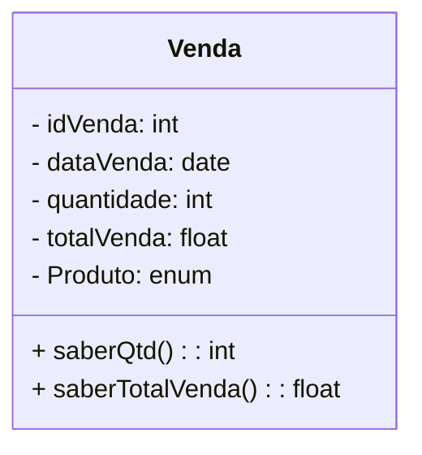

```mermaid
classDiagram
   class Venda {
      - idVenda: int
      - dataVenda: date
      - quantidade: int
      - totalVenda: float
      - Produto: enum
      + saberQtd(): int
      + saberTotalVenda(): float
}
```
